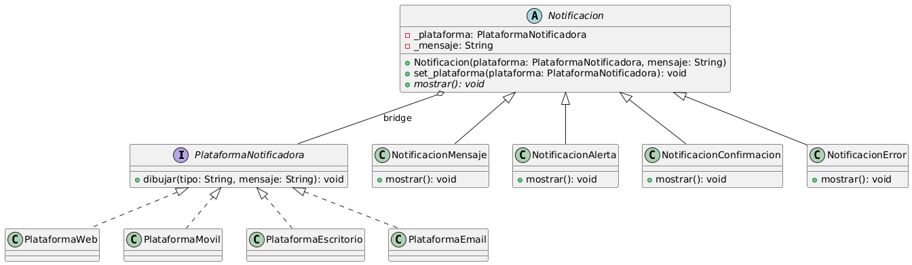

# Actividad 1

## Ejercicio 1

### Tipo de patrón

_Creacional_

### Patrón

_Builder_

Se selecciono el patrón _builder_ ya que este permite la creación de objectos complejos al mismo tiempo que separa la lógica de creación del objeto a crear.

### Diagrama de clases


### Ejecutar

```bash
cd ./ejercicio_1
python main.py
```

## Ejercicio 2

### Tipo de patrón

_Estructural_

### Patrón

_Bridge_

Se seleccionó el patrón Bridge porque permite separar la abstracción (las notificaciones) de su implementación (las plataformas). De esta manera se evita la explosión de clases al no tener que crear una clase distinta por cada combinación de tipo de notificación y plataforma.

### Diagrama de clases



### Ejecutar

```bash
cd ./ejercicio_2
python main.py
```

## Ejercicio 3

### Tipo de patrón

_Comportamiento_

### Patrón

_Mediator_

Se selecciono el patrón _builder_ ya que este permite la creación de objectos complejos al mismo tiempo que separa la lógica de creación del objeto a crear.

### Diagrama de clases


### Ejecutar

```bash
cd ./ejercicio_3
python main.py
```
